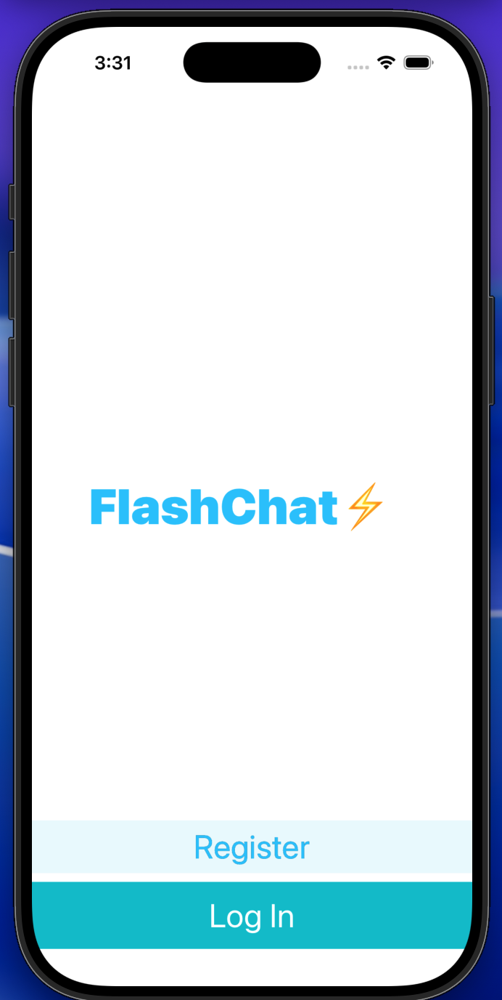
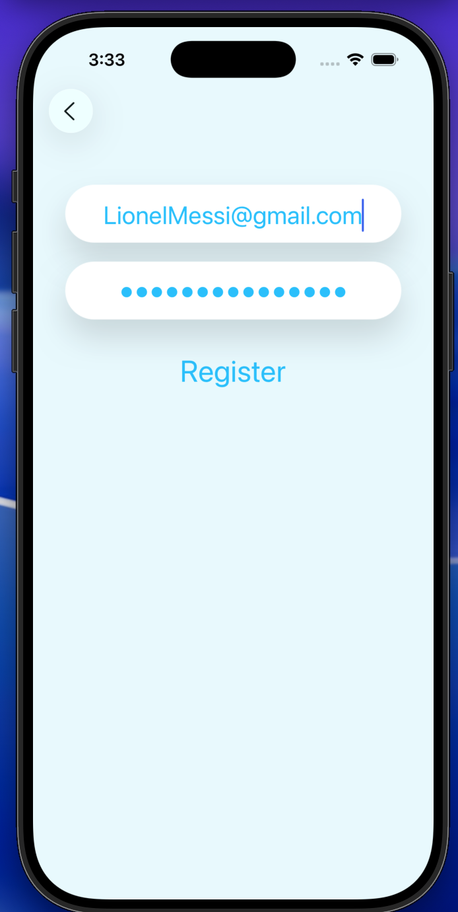
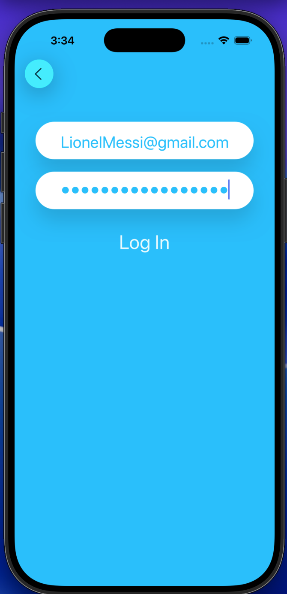
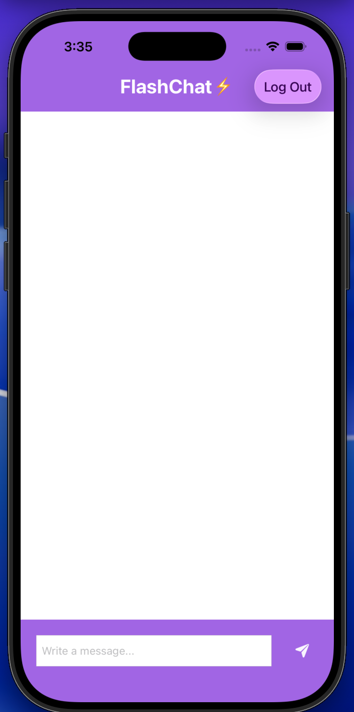
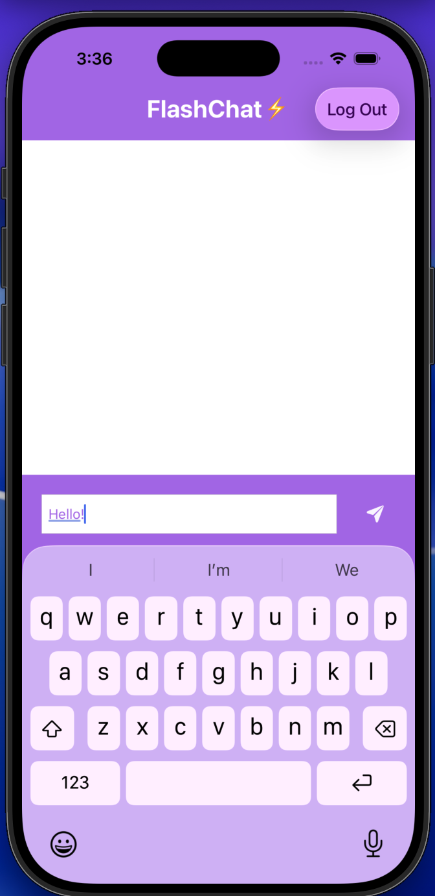
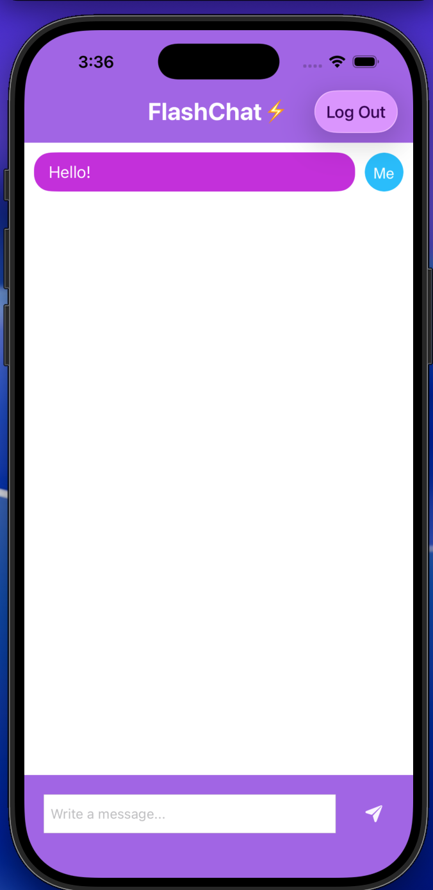
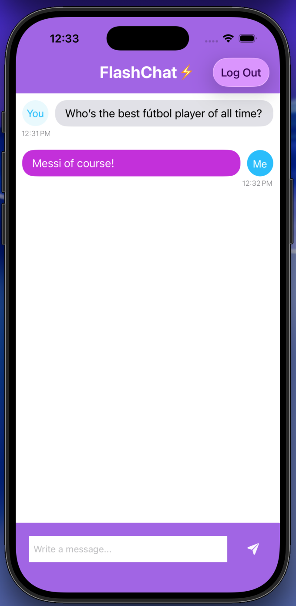

# ⚡ FlashChat  
A modern real-time chat application built with **Swift**, **UIKit**, and **Firebase**.  
This project demonstrates clean architecture, real-time data syncing using **Firestore**, custom UI components, dynamic keyboard handling, and polished animations.

---

## 📱 Features

### 🔐 User Authentication
- Register new users with email & password  
- Secure login using Firebase Authentication  
- Automatic session handling  

### 💬 Real-Time Messaging
- Messages sync instantly using **Firestore Snapshot Listeners**
- Messages auto-sort by timestamp  
- Smooth autoscroll to latest message  

### 👤 Sender & Receiver UI
- Custom `UITableViewCell` showing:
  - Left avatar for messages from other users  
  - Right avatar for messages sent by you  
- Dynamic bubble color and alignment  
- Supports multi-line text with auto-sizing  

### 🎨 Custom UI & Animations
- Polished UIKit interface  
- GhostTypewriter animation on welcome screen  
- Adaptive keyboard-safe input field (using `keyboardLayoutGuide`)  
- Fully autolayout-driven design  

### 📦 Swift Package Manager (SPM)
All external libraries installed via SPM:
- FirebaseAuth  
- FirebaseFirestore  
- GhostTypewriter  

---

## 🚀 Screenshots

### **Landing & Registration**
| Landing | Register |
|--------|----------|
|  |  |

---

### **Authentication**
| Log In |
|--------|
|  |

---

### **Chat Interface**
| Empty Chat | Typing | Sent | Chatting |
|------------|--------|------|----------|
|  |  |  |  |

---

## 🏗️ Project Structure
```text
FlashChat/
├── Controllers/
│ ├── WelcomeViewController.swift
│ ├── RegisterViewController.swift
│ ├── LoginViewController.swift
│ └── ChatViewController.swift
│
├── Models/
│ └── Message.swift
│
├── Views/
│ ├── MessageCell.xib
│ └── MessageCell.swift
│
├── Screenshots/
│ └── (all images used in README)
│
├── Constants.swift
├── AppDelegate.swift
├── GoogleService-Info.plist
└── README.md
```
---

## 🧰 Technologies Used

| Technology | Purpose |
|-----------|---------|
| **Swift 5** | Main programming language |
| **UIKit** | UI framework |
| **Firebase Auth** | User authentication |
| **Firebase Firestore** | Real-time database |
| **Swift Package Manager** | Dependency management |
| **AutoLayout** | Responsive UI layouts |
| **KeyboardLayoutGuide** | Modern keyboard handling |

---

## 🛠️ Installation & Setup

### 1️⃣   Clone the repository
```bash
git clone https://github.com/alexjowilson/FlashChat.git
cd FlashChat
```
### 2️⃣   Install dependencies (automatically handled by SPM)

Open the project in Xcode — SPM will fetch all packages.

### 3️⃣   Add your Firebase configuration

Place your GoogleService-Info.plist inside the root of the Xcode project.

### 4️⃣   Run the app

Choose a simulator and hit ⌘ + R.

## 💡 What I Learned

Integrating Firebase using SPM

Building a real-time app with Firestore snapshot listeners

Designing custom chat UI with dynamic auto-sizing cells

Understanding optional binding (if let) and user authentication flows

Using keyboardLayoutGuide to create responsive chat input UX

Removing CocoaPods and migrating old projects to SPM

Working with Storyboards + XIB-based reusable cells

## 📬 Contact

If you'd like to connect or have questions about this project, feel free to reach out by email @alexjowilson7@gmail.com!
