# ⚡ FlashChat  
A modern real-time chat application built with **Swift**, **UIKit**, and **Firebase**.  
This project demonstrates clean architecture, real-time data syncing using **Firestore**, custom UI components, dynamic keyboard handling, and polished animations.

---

## 📱 Features

### 🔐 User Authentication
- Register new users with email & password  
- Secure login using Firebase Authentication  
- Automatic session handling 
- Input validation with user-friendly error alerts 

### 👤 Profile Setup
- Display name entry on first registration
- Profile photo upload via camera or photo library
- Photos stored in **Firebase Storage**
- Profile data persisted in **Firestore** users collection
- Returning users skip profile setup automatically

### 💬 Real-Time Messaging
- Messages sync instantly using **Firestore Snapshot Listeners**
- Messages auto-sort by timestamp  
- Smooth autoscroll to latest message
- Timestamps displayed on each message with sender-based alignment 
- Toast notifications for message status
- Empty message validation

### 🧑‍🤝‍🧑 Sender & Receiver UI
- Custom `UITableViewCell` showing:
  - Left avatar + timestamp for messages from other users  
  - Right avatar + timestamp for messages sent by you  
- Profile photos loaded asynchronously with in-memory `NSCache` image caching
- Placeholder avatar shown while photo loads or if none is set
- Dynamic bubble color and alignment  
- Supports multi-line text with auto-sizing cells

### 🎨 Custom UI & Animations
- Polished UIKit interface  
- GhostTypewriter animation on welcome screen  
- Adaptive keyboard-safe input field (using `keyboardLayoutGuide`)  
- Fully autolayout-driven design 

### 🔔 Toast Notifications
- Message sent confirmation
- Empty message validation
- Login error feedback
- Custom animated toast UI

### 📦 Swift Package Manager (SPM)
All external libraries installed via SPM:
- FirebaseAuth  
- FirebaseFirestore
- FirebaseStorage
- GhostTypewriter  

---

## 🚀 Screenshots

### **Landing & Registration**
| Landing | Register |
|--------|----------|
| 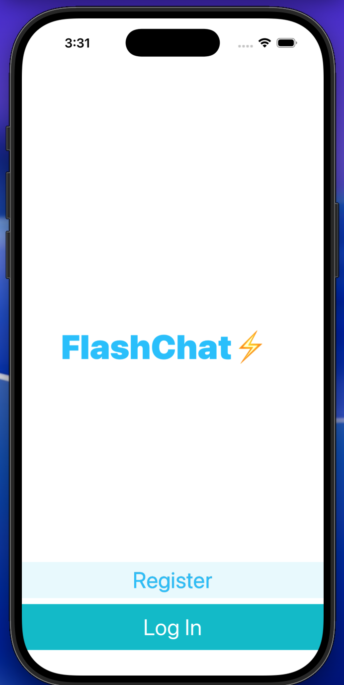 | 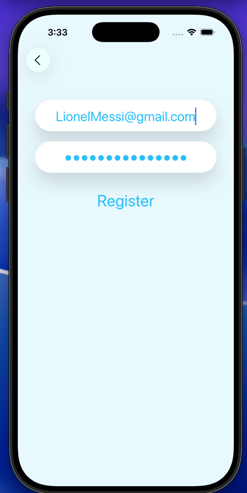 |

---

### **Authentication**
| Log In | Missing Credentials | Invalid Login |
|--------|---------------------|---------------|
| 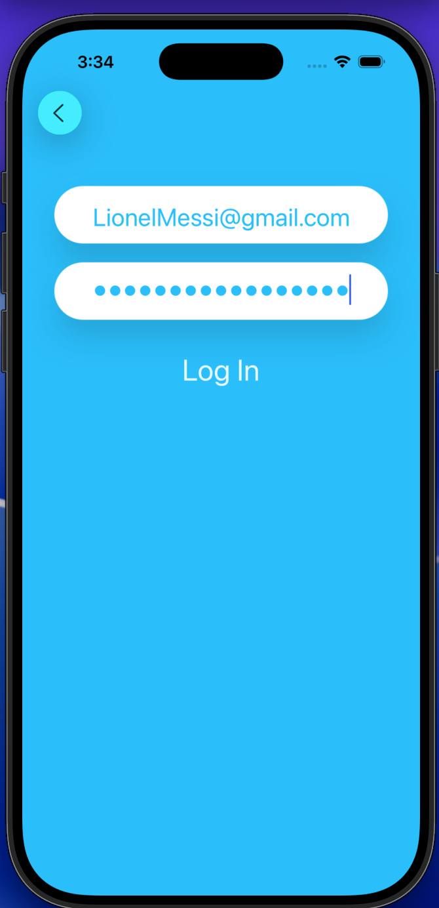 | 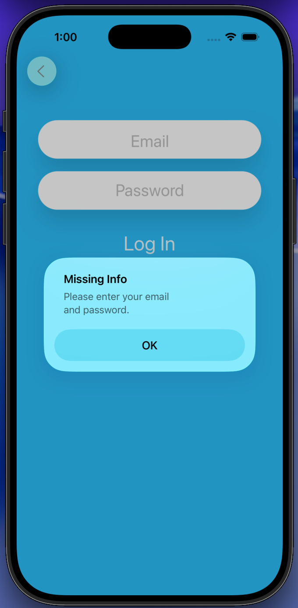 | 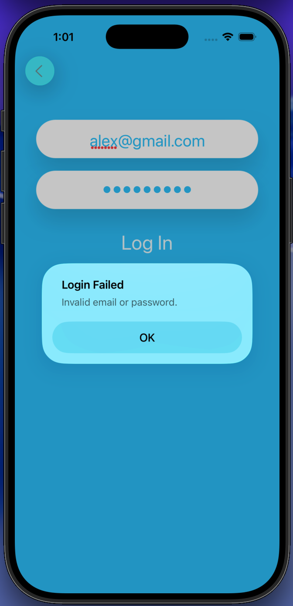 |

---

### **Chat Interface**
| Empty Chat | Typing | Group Chat |
|------------|--------|------------|
| 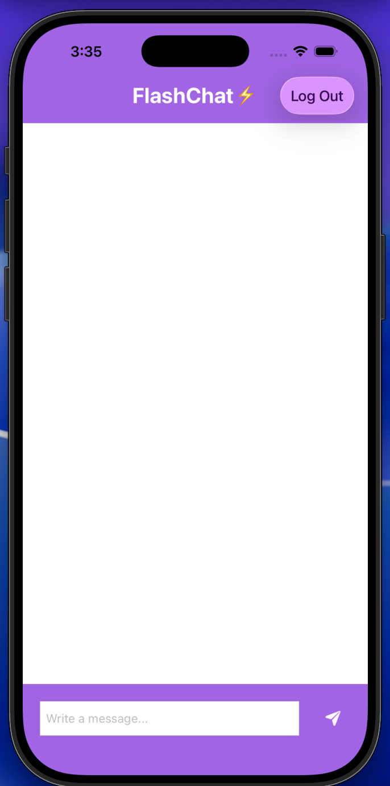 | 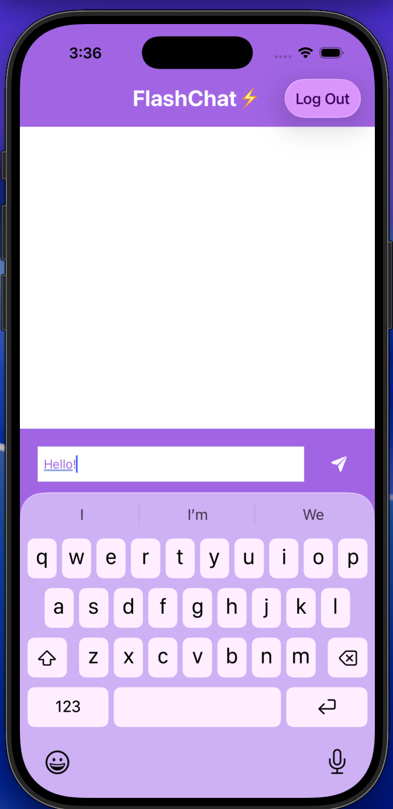 | 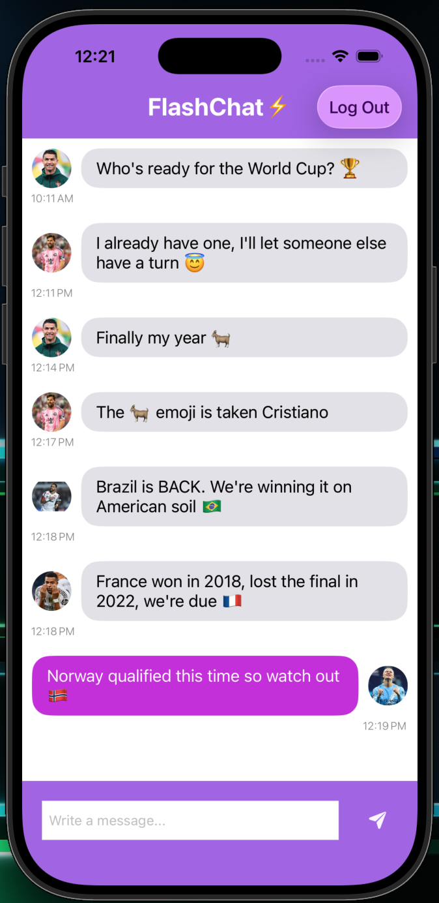 |

---

### **Toast Notifications**
| Empty Message | Message Sent |
|---------------|--------------|
| 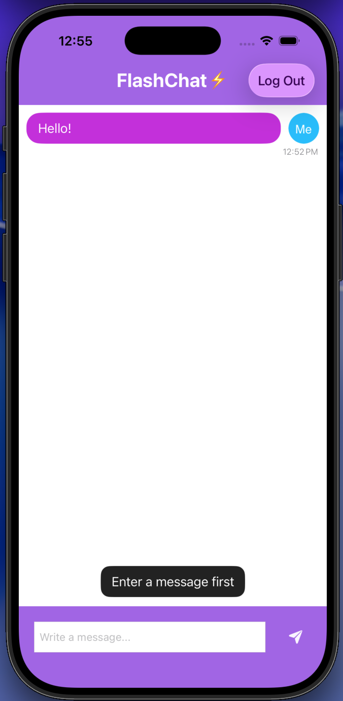 | 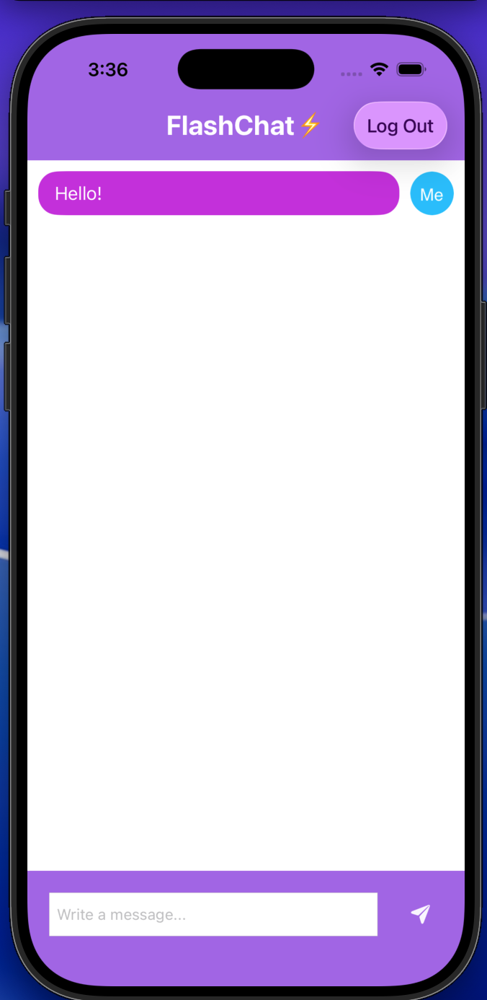 |

---

## 🏗️ Project Structure
```text
FlashChat/
├── Controllers/
│   ├── WelcomeViewController.swift
│   ├── RegisterViewController.swift
│   ├── LoginViewController.swift
│   ├── ProfileSetupViewController.swift
│   └── ChatViewController.swift
│
├── Models/
│   └── Message.swift
│
├── Views/
│   ├── MessageCell.xib
│   └── MessageCell.swift
│
├── Screenshots/
│   └── (all images used in README)
│
├── AppDelegate.swift
├── SceneDelegate.swift
├── Constants.swift
├── Utils.swift
├── GoogleService-Info.plist
└── README.md
```

## 🧰 Technologies Used

| Technology | Purpose |
|-----------|---------|
| **Swift 5** | Main programming language |
| **UIKit** | UI framework |
| **Firebase Auth** | User authentication |
| **Firebase Firestore** | Real-time database |
| **Firebase Storage** | Profile photo storage |
| **Swift Package Manager** | Dependency management |
| **AutoLayout** | Responsive UI layouts |
| **KeyboardLayoutGuide** | Modern keyboard handling |
| **NSCache** | In-memory image caching |

---

## 🛠️ Installation & Setup

### 1️⃣   Clone the repository
```bash
git clone https://github.com/alexjowilson/FlashChat.git
cd FlashChat
```
### 2️⃣   Install dependencies (automatically handled by SPM)

Open the project in Xcode — SPM will fetch all packages.

### 3️⃣   Add your Firebase configuration

Place your GoogleService-Info.plist inside the root of the Xcode project.

### 4️⃣   Run the app

Choose a simulator and hit ⌘ + R.

---

## 💡 What I Learned

- Integrating Firebase Auth, Firestore, and Storage using SPM
- Building a real-time app with Firestore snapshot listeners
- Uploading and retrieving images with Firebase Storage
- Designing custom chat UI with dynamic auto-sizing cells
- Implementing an in-memory image cache with `NSCache` to avoid redundant network requests
- Fixing threading bugs — dispatching UI and navigation calls to the main thread from Firestore callbacks
- Eliminating race conditions by sequencing async profile fetches before enabling user interaction
- Understanding optional binding (`if let`) and user authentication flows
- Using `keyboardLayoutGuide` to create responsive chat input UX
- Removing CocoaPods and migrating old projects to SPM
- Working with Storyboards + XIB-based reusable cells
- Implementing dual-label layouts for dynamic UI alignment
- Denormalizing Firestore data (embedding sender profile pic URL in message documents) to avoid per-cell reads

---

## 🧠 Reliability & Memory Profiling (Xcode Instruments)

To validate memory behavior and catch potential retain cycles, I profiled the core user flow using **Xcode Instruments**:

**Tested flow:** login → send message → logout → login again  
**Tools used:** Leaks + Allocations

✅ **Result:** No memory leaks were detected during this session, and allocations remained stable across repeated auth/chat cycles.

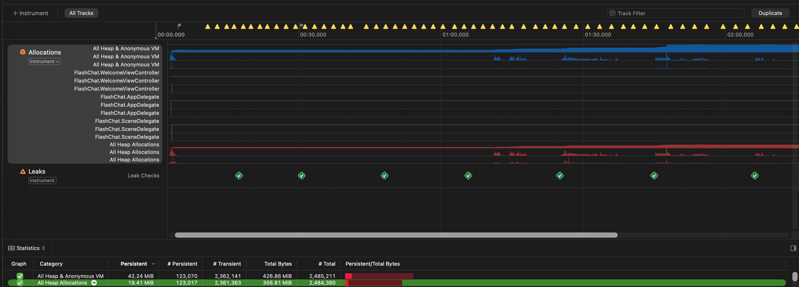

---

## 📬 Contact

If you'd like to connect or have questions about this project, feel free to reach out by email @alexjowilson7@gmail.com!
